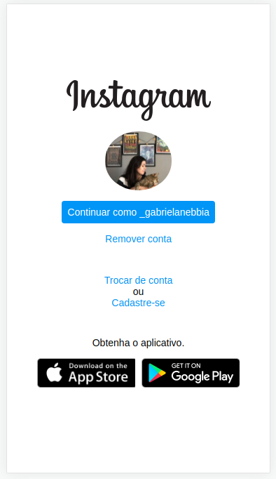

# DIO - Design Responsivo

Projeto desenvolvido no bootcamp HTML Web Developer oferecido pela [Digital Innovation One](https://digitalinnovation.one/).

## Objetivo do projeto

Recriar a página de login do Instagram utilizando CSS com Flexbox.

